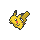

[TOC]

# Layout

## text-align

<kbd>text-align</kbd>은 글자 및 개체들을 정렬해주는 속성이다.<br>

<br>

<kbd>text-align</kbd>에는 다음과 같은 값이 있다.<br>

<br>

```scss
text-align: 값;
/*left : 왼쪽 정렬, right : 오른쪽 정렬, center : 가운데 정렬, justify : 양쪽 정렬*/
```

<br>

<br>

이제 글자를 가운데로 보내고 싶으면 text-align을 쓰면 된다.<br>

<br>

```html
<style>
    div{
        border: 3px solid red;
    }
    #left{
        text-align: left;
    }
    #right{
        text-align: right;
    }
    #center{
        text-align: center;
    }
</style>
<body>
    <div id="left">CSS(Cascading Stylesheets – 종속형 스타일시트)는<br>HTML을 익힌 후 가장 먼저 배워야할 웹기술입니다.<br>HTML이 콘텐츠의 구조와 의미를 정의하는 반면<br>CSS는 스타일과 레이아웃을 지정합니다.<br>예를 들어, CSS를 사용하면 콘텐츠의 글꼴, 색상, 크기 및 간격을 변경하거나,<br>여러 개의 열로 분할하거나,<br>애니메이션이나 기타 장식 효과를 추가할 수 있습니다.</div>
    <div id="right">CSS(Cascading Stylesheets – 종속형 스타일시트)는<br>HTML을 익힌 후 가장 먼저 배워야할 웹기술입니다.<br>HTML이 콘텐츠의 구조와 의미를 정의하는 반면<br>CSS는 스타일과 레이아웃을 지정합니다.<br>예를 들어, CSS를 사용하면 콘텐츠의 글꼴, 색상, 크기 및 간격을 변경하거나,<br>여러 개의 열로 분할하거나,<br>애니메이션이나 기타 장식 효과를 추가할 수 있습니다.</div>
    <div id="center">CSS(Cascading Stylesheets – 종속형 스타일시트)는<br>HTML을 익힌 후 가장 먼저 배워야할 웹기술입니다.<br>HTML이 콘텐츠의 구조와 의미를 정의하는 반면<br>CSS는 스타일과 레이아웃을 지정합니다.<br>예를 들어, CSS를 사용하면 콘텐츠의 글꼴, 색상, 크기 및 간격을 변경하거나,<br>여러 개의 열로 분할하거나,<br>애니메이션이나 기타 장식 효과를 추가할 수 있습니다.</div>
</body>
```

<br>

<br>

<div data-class="div1" data-id="left-1">CSS(Cascading Stylesheets – 종속형 스타일시트)는<br>HTML을 익힌 후 가장 먼저 배워야할 웹기술입니다.<br>HTML이 콘텐츠의 구조와 의미를 정의하는 반면<br>CSS는 스타일과 레이아웃을 지정합니다.<br>예를 들어, CSS를 사용하면 콘텐츠의 글꼴, 색상, 크기 및 간격을 변경하거나,<br>여러 개의 열로 분할하거나,<br>애니메이션이나 기타 장식 효과를 추가할 수 있습니다.</div><div data-class="div1" data-id="right-1">CSS(Cascading Stylesheets – 종속형 스타일시트)는<br>HTML을 익힌 후 가장 먼저 배워야할 웹기술입니다.<br>HTML이 콘텐츠의 구조와 의미를 정의하는 반면<br>CSS는 스타일과 레이아웃을 지정합니다.<br>예를 들어, CSS를 사용하면 콘텐츠의 글꼴, 색상, 크기 및 간격을 변경하거나,<br>여러 개의 열로 분할하거나,<br>애니메이션이나 기타 장식 효과를 추가할 수 있습니다.</div><div data-class="div1" data-id="center-1">CSS(Cascading Stylesheets – 종속형 스타일시트)는<br>HTML을 익힌 후 가장 먼저 배워야할 웹기술입니다.<br>HTML이 콘텐츠의 구조와 의미를 정의하는 반면<br>CSS는 스타일과 레이아웃을 지정합니다.<br>예를 들어, CSS를 사용하면 콘텐츠의 글꼴, 색상, 크기 및 간격을 변경하거나,<br>여러 개의 열로 분할하거나,<br>애니메이션이나 기타 장식 효과를 추가할 수 있습니다.</div>

<br>

<br>

## vertical-align

<kbd>vertical-align</kbd>은 <kbd>display</kbd>속성이 <kbd>inline</kbd>인 경우 혹은 <kbd>table-cell</kbd> (\<td\>)인 경우에만 쓰인다.<br>

<br>

```scss
vertical-align: baseline;
/*top : 위쪽 정렬, bottom : 아래쪽 정렬, middle : 가운데 정렬, baseline : 같은 행의 다른 값들과 맞춤*/
```

<br>

<br>

```html
<style>
    #top{
        vertical-align: top;
    }
    #bottom{
        vertical-align: bottom;
    }
    #middle{
        vertical-align: middle;
    }
    #baseline{
        vertical-align: baseline;
    }
</style>
<body>
    <div>
         top 정렬입니다.
    </div>
    <div>
         bottom 정렬입니다.
    </div>
    <div>
         middle 정렬입니다.
    </div>
    <div>
         baseline 정렬입니다.
    </div>
</body>
```

<br>

<br>

<div> top 정렬입니다.</div><div> bottom 정렬입니다.</div><div> middle 정렬입니다.</div><div> baseline 정렬입니다.</div>
<br>

<br>

특이한 점이라면 정렬을 할 때 부모 태그에 써주는 것이 아니라, 이미지 자체에 써준다는 점이다.<br>

<br>

테이블 또한 비슷하게 작성하면 된다.<br>

<br>


## float

<kbd>float</kbd>는 개체를 떠다니게 해주는 속성이다.<br>

<br>

<kbd>float</kbd>는 <kbd>left</kbd> 혹은 <kbd>right</kbd> 값만 존재한다.<br>

<br>

또한 <kbd>clear</kbd> 속성은 <kbd>float</kbd>의 영향을 받지 않도록 하는 속성이고 마찬가지로 <kbd>left</kbd> 혹은 <kbd>right</kbd> 값 그리고 <kbd>both</kbd>만 존재한다.<br>

<br>

```html
<style>
    img{
        width:100px;
    }
    .left{
        float: left;
    }
    .right{
        float: right;
    }
    .bord{
        width: 400px;
        border: 1px solid blue;
        clear: both;
        background-color: gainsboro;
    }
    span{
        border: 1px solid red;
        display: inline-block;
    }
    .cen{
        text-align: center;
    }
</style>
<body>
    <div class="bord">
        <span class="left"><div class="cen">float: left</div></span><div>1번 문장</div><div>2번 문장</div>			<div>3번 문장</div>
        <span><div class="cen">normal</div></span>
    </div>
    <div class="bord">
        <span><div class="cen">normal</div></span><div>1번 문장</div><div>2번 문장</div><div>3번 문장</div>
        <span><div class="cen">normal</div></span>
    </div>
    <div class="bord" style="height:fit-content;">
        <h1>overflow: normal</h1>
        <span class="left"><div class="cen">float: left</div></span>
        <span class="left"><div class="cen">float: left</div></span>
        <div>1번 문장</div><div>2번 문장</div><div>3번 문장</div>
    </div>
    <div class="bord" style="overflow: hidden;height:fit-content;">
        <h1>overflow: hidden</h1>
        <span class="left"><div class="cen">float: left</div></span>
        <span class="left"><div class="cen">float: left</div></span>
        <div>1번 문장</div><div>2번 문장</div><div>3번 문장</div>
    </div>
    <div class="bord" style="overflow: hidden;height:fit-content;">
        <h1>overflow: hidden</h1>
        <span class="left"><div class="cen">float: left</div></span>
        <span class="right"><div class="cen">float: right</div></span>
        <div></div><div>1번 문장</div><div>2번 문장</div><div>3번 문장</div>
    </div>
</body>
```

<br>

<br>

<div data-class="bord"><span data-class="span1 left"><div data-class="cen">float: left</div></span><div>1번 문장</div><div>2번 문장</div><div>3번 문장</div><span data-class="span1"><div data-class="cen">normal</div></span></div><div data-class="bord"><span data-class="span1"><div data-class="cen">normal</div></span><div>1번 문장</div><div>2번 문장</div><div>3번 문장</div><span data-class="span1"><div data-class="cen">normal</div></span></div><div data-class="bord" style="height:fit-content;"><h1>overflow: normal</h1><span data-class="span1 left"><div data-class="cen">float: left</div></span><span data-class="span1 left"><div data-class="cen">float: left</div></span><div>1번 문장</div><div>2번 문장</div><div>3번 문장</div></div><div data-class="bord" style="overflow:hidden;height:fit-content;"><h1>overflow: hidden</h1><span data-class="span1 left"><div data-class="cen">float: left</div></span><span data-class="span1 left"><div data-class="cen">float: left</div></span><div>1번 문장</div><div>2번 문장</div><div>3번 문장</div></div><div data-class="bord" style="overflow:hidden;height:fit-content;"><h1>overflow: hidden</h1><span data-class="span1 left"><div data-class="cen">float: left</div></span><span data-class="span1 right"><div data-class="cen">float: right</div></span><div>긴문장긴문장긴문장긴문장긴문장긴문장</div><div>1번 문장</div><div>2번 문장</div><div>3번 문장</div></div>

<br>

<br>

여기서 꼭 기억해야할 것!!!<br>

<br>

1. <kbd>float</kbd>와 <kbd>clear</kbd>는 항상 같이 다닌다는 것.
2. <kbd>clear</kbd> 에는 <kbd>left</kbd>, <kbd>right</kbd> 뿐만 아니라 <kbd>both</kbd> 속성도 존재한다는 것.

<br>

```scss
float: left;/*left, right*/
clear: both;/*both, left, right*/
```

<br>

<br>

## position

<kbd>position</kbd> 속성은 개체를 이동시키는 것에 대한 방법을 제공하는 속성이다.<br>

<br>

<kbd>position</kbd> 에는 총 5가지 속성이 있다.<br>

<br>

```scss
position: static;
/*static : 기본값
absolute : 페이지에서 절대값으로 배치
relative : 원래위치에서 배치
fixed : 브라우저 창에 배치
sticky : 스크롤 창에 배치*/
```

<br>

```html
<style>
    .img1{
        max-width:100px;
        vertical-align: middle;
    }
    .bord{
        width: 400px;
        height: 400px;
        border: 1px solid blue;
        clear: both;
        overflow: auto;
        background-color: gainsboro;
    }
    .cen{
        text-align: center;
    }
    .bor{
        border: 1px solid red;
    }
    .span2{
        cursor: pointer;
        position:sticky;
        border: 1px solid red;
    }
    #fix{
        top:0;
    }
    #sta{
        top:25px;
    }
    #rel{
        top:50px;
    }
    #sti{
        top:75px;
    }
    #fix:hover ~ #pica{
        position: fixed;
        left: 40px;
        top: 40px;
    }
    #sta:hover ~ #pica{
        position: static;
    }
    #rel:hover ~ #pica{
        position: relative;
        left: 40px;
        top: 40px;
    }
    #sti:hover ~ #pica{
        position: sticky;
        left: 40px;
        top: 40px;
    }
    .table1{
        border: 3px solid gold;
        border-collapse: collapse;
    }
    .th1{
        color: white;
        background-color: gold;
    }
    .th1, .td1{
        border: 1px solid #ddd;
        text-align: center;
        min-width: 150px;
        max-width: 250px;
        font-size: 14px;
        padding:5px;
    }
    .td1{
        height: 80px;
    }
</style>
<body>
    <div class="bord" style="width:fit-content;background-color: white;">
        <h1>left: 40px, top: 40px 을 주었을 때</h1>
        <span class="span2" id="fix">position: fixed</span><br>
        <span class="span2" id="sta">position: static</span><br>
        <span class="span2" id="rel">position: relative</span><br>
        <span class="span2" id="sti">position: sticky</span><br>
        
        
        
        <table class="table1">
            <tr>
                <th class="th1" colspan="3">기본 정보</th>
            </tr>
            <tr>
                <th class="th1" colspan="3">이름</th>
            </tr>
            <tr>
                <th class="th1">한국어</th>
                <th class="th1">일본어</th>
                <th class="th1">영어</th>
            </tr>
            <tr>
                <td class="td1"> 피카츄</td>
                <td class="td1">ピカチュウ</td>
                <td class="td1">Pikachu</td>
            </tr>
            <tr>
                <td class="td1" colspan="3">홍콩을 제외할 경우 <strong>세계 공통 명칭</strong></td>
            </tr>
            <tr>
                <th class="th1">도감 번호</th>
                <th class="th1">성비</th>
                <th class="th1">타입</th>
            </tr>
            <tr>
                <td class="td1">전국: 025<br>
                    성도: 022<br>
                    호연: 156RSE / 163ORAS<br>
                    신오: 104<br>
                    센트럴칼로스: 036<br>
                    알로라: 025SM / 032USUM<br>
                    가라르: 194본토 / 085갑옷섬</td>
                <td class="td1">수컷: 50%<br>암컷: 50%</td>
                <td class="td1">전기</td>
            </tr>
        </table>
    </div>
</body>
```

<br>

<br>

<div data-class="bord" style="width:fit-content;background-color: white;"> <h1>left: 40px, top: 40px 을 주었을 때</h1> <span data-class="span2" data-id="fix">position: fixed</span><br><span data-class="span2" data-id="sta">position: static</span><br><span data-class="span2" data-id="rel">position: relative</span><br><span data-class="span2" data-id="sti">position: sticky</span><br>   <table data-class="table1"> <tr> <th data-class="th1" colspan="3">기본 정보</th> </tr><tr> <th data-class="th1" colspan="3">이름</th> </tr><tr> <th data-class="th1">한국어</th> <th data-class="th1">일본어</th> <th data-class="th1">영어</th> </tr><tr> <td data-class="td1"> 피카츄</td><td data-class="td1">ピカチュウ</td><td data-class="td1">Pikachu</td></tr><tr> <td data-class="td1" colspan="3">홍콩을 제외할 경우 <strong>세계 공통 명칭</strong></td></tr><tr> <th data-class="th1">도감 번호</th> <th data-class="th1">성비</th> <th data-class="th1">타입</th> </tr><tr> <td data-class="td1">전국: 025<br>성도: 022<br>호연: 156RSE / 163ORAS<br>신오: 104<br>센트럴칼로스: 036<br>알로라: 025SM / 032USUM<br>가라르: 194본토 / 085갑옷섬</td><td data-class="td1">수컷: 50%<br>암컷: 50%</td><td data-class="td1">전기</td></tr></table> </div>

<br>

<br>

<kbd>postion</kbd>을 적재적소에 잘 활용하는 것이 매우 중요하다.<br>

<br>

<br>

# 문제들

## 문제 1

<iframe src="1.html"></iframe>
<br>
<br>
## 문제 2

<iframe src="2.html"></iframe>
<br>
<br>
## 문제 3

<iframe src="3.html"></iframe>
<br>
<br>
## 문제 4

<iframe src="4.html"></iframe>
<br>
<br>
## 문제 5

<iframe src="5.html"></iframe>